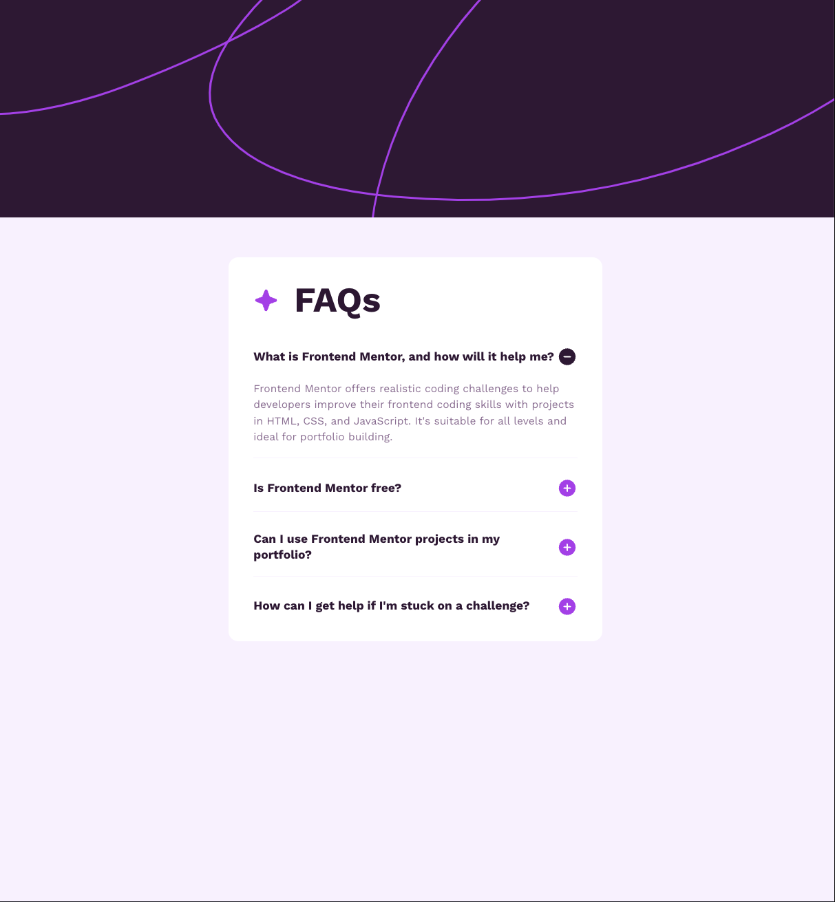

# Frontend Mentor - FAQ accordion solution

This is a solution to the [FAQ accordion challenge on Frontend Mentor](https://www.frontendmentor.io/challenges/faq-accordion-wyfFdeBwBz). Frontend Mentor challenges help you improve your coding skills by building realistic projects.

## Table of contents

- [Overview](#overview)
  - [The challenge](#the-challenge)
  - [Screenshot](#screenshot)
  - [Links](#links)
- [My process](#my-process)
  - [Built with](#built-with)
  - [What I learned](#what-i-learned)
  - [Continued development](#continued-development)
  - [Useful resources](#useful-resources)
- [Author](#author)
- [Acknowledgments](#acknowledgments)

## Overview

### The challenge

Users should be able to:

- Hide/Show the answer to a question when the question is clicked
- Navigate the questions and hide/show answers using keyboard navigation alone
- View the optimal layout for the interface depending on their device's screen size
- See hover and focus states for all interactive elements on the page

### Screenshot

### Links

- Solution URL: [Github repo](https://github.com/mrcordova/faq-accordion-main)
- Live Site URL: [Github page](https://mrcordova.github.io/faq-accordion-main/)

## My process

### Built with

- Semantic HTML5 markup
- CSS custom properties
- Flexbox
- Mobile-first workflow

### What I learned

I learned to use transitions to work with changes in displays

### Continued development

I want to learn more about transtions and animations

### Useful resources

- [How min-width works](https://stackoverflow.com/questions/198153/why-does-the-css-min-width-attribute-not-force-a-div-to-have-the-specified-minim) - It gave me understanding how min width works.

## Author

- Website - [mrcordova](https://github.com/mrcordova)
- Frontend Mentor - [@mrcordova](https://www.frontendmentor.io/profile/mrcordova)
